<p align="center">
  
</p>

Internal terminal operations console for AWS infrastructure management.

```
┌──────────────┐         ┌──────────────────┐         ┌─────────┐
│  TUI Client  │──HTTP──▶│  Control Plane   │──STS───▶│   AWS   │
│  (ratatui)   │         │  (axum)          │         │ EC2/CWL │
│              │◀─JSON───│                  │◀────────│ SSM/STS │
└──────────────┘         │  - Auth (OIDC)   │         └─────────┘
                         │  - Entitlements  │
                         │  - Audit logging │
                         │  - Server-side   │
                         │    filtering     │
                         └──────────────────┘
```

| Crate | Path | Purpose |
|-------|------|---------|
| `shared` | `crates/shared` | Shared DTOs, error types |
| `control-plane` | `apps/control-plane` | Axum REST API — auth, entitlements, AWS access |
| `tui-client` | `apps/tui-client` | Ratatui terminal UI — 7 screens, event loop |

---

## Quick start (local development)

### Prerequisites

- Rust 1.75+
- Two terminal windows

> AWS CLI and Session Manager plugin are only needed for the `connect` feature (SSM/EIC). All other features work without them.

### Step 1: Build

```bash
cd ~/Desktop/Canopy
cargo build
cargo test        # 39 tests, should all pass
```

### Step 2: Start the control-plane (Terminal 1)

```bash
CONFIG_PATH=config.dev.toml cargo run -p control-plane
```

You should see:
```
Loaded entitlements from "entitlements.dev.toml": 2 rules, 2 memberships
Control-plane listening on 127.0.0.1:8443
```

### Step 3: Start the TUI (Terminal 2)

```bash
DEV_MODE=1 cargo run -p tui-client
```

The TUI opens on the login screen. Type `dev-admin` and press Enter.

### Step 4: Explore

| Screen | How to get there | What it shows |
|--------|-----------------|---------------|
| Dashboard | Automatic after login | Welcome message, navigation menu |
| EC2 Inventory | Press `1` | 5 mock instances, search with `/`, detail with `Enter` |
| CloudWatch Search | Press `2` | Query input, mock log events |
| Access / Identity | Press `4` | Your user, groups, feature flags, allowed accounts |
| Settings | Press `5` | Current config values; press `p` to open Change Password |

Press `Esc` to go back, `Ctrl+x` on Dashboard to log out, `q` to quit.

### Dev users

Two users are pre-configured in `entitlements.dev.toml`:

| Username | Group | What they can do |
|----------|-------|-----------------|
| `dev-admin` | platform-engineering | Everything: EC2, CloudWatch, SSM, EIC across 2 accounts |
| `dev-readonly` | readonly-ops | Read-only: EC2 view + CloudWatch search on staging only, no connect |

Try logging in as `dev-readonly` to see how the UI hides features the user doesn't have.

---

## Project files

```
Canopy/
├── config.dev.toml            ← Control-plane config (local dev)
├── config.sample.toml         ← Control-plane config (production template)
├── entitlements.dev.toml      ← Permission rules (local dev)
├── .env.example               ← Environment variables reference
├── Cargo.toml                 ← Workspace root
│
├── apps/
│   ├── control-plane/         ← Backend server (includes Dockerfile)
│   └── tui-client/            ← Terminal UI (auto-update support)
│
├── crates/
│   └── shared/                ← Shared types
│
├── infra/                     ← Terraform IaC for ECS Fargate deployment
│
├── scripts/
│   ├── package.sh             ← TUI packaging for distribution
│   └── docker-entrypoint.sh   ← Container startup + Secrets Manager injection
│
└── docs/
    ├── PRD.md                 ← Product requirements (中文)
    ├── ARCHITECTURE.md        ← Full architecture reference
    ├── ECS_FARGATE_DEPLOYMENT.md ← ECS deployment (manual / Terraform)
    ├── COGNITO-SETUP.md       ← AWS Cognito OIDC setup
    ├── OPERATOR-SETUP.md      ← TUI distribution to operators
    └── RELEASING.md           ← Release workflow & CI
```

---

## Configuration reference

### Control-plane config (`config.dev.toml` / `config.toml`)

```toml
# ── Server ──────────────────────────────────────────
bind_address = "127.0.0.1:8443"   # IP:port to listen on
dev_mode = true                    # true = enables dev-login
                                   # false = requires OIDC

# ── AWS data source ────────────────────────────────
# mock_aws_data controls whether EC2/CloudWatch use mock or real AWS.
# Defaults to dev_mode value if omitted.
# Set to false while keeping dev_mode = true to use dev-login with real AWS.
# mock_aws_data = false

# ── Entitlements ────────────────────────────────────
# Path to the permission rules file (TOML).
# Required when dev_mode = false.
# Optional when dev_mode = true (falls back to built-in dev defaults).
entitlements_file = "entitlements.dev.toml"

# ── Audit ───────────────────────────────────────────
# Optional. When set, every action is appended to this file as JSON-lines.
# If not set, audit events are only emitted via structured tracing (stdout).
# audit_log = "/var/log/canopy/audit.jsonl"

# ── CORS ────────────────────────────────────────────
# List of allowed origins. Empty + dev_mode = allow all.
# cors_allowed_origins = ["http://localhost:9876"]

# ── OIDC ────────────────────────────────────────────
# Not used in dev mode (dev-login bypasses OIDC).
# Required for production — see "Production deployment" below.
[oidc]
issuer_url = "https://placeholder.example.com"
client_id = "not-used-in-dev-mode"
# client_secret = "optional-for-public-pkce-clients"
# scopes = ["openid", "profile", "email"]        # default
#
# Optional endpoint overrides (auto-discovered from issuer_url if omitted):
# authorization_endpoint = "https://..."
# token_endpoint = "https://..."
# device_authorization_endpoint = "https://..."
# jwks_uri = "https://..."

# ── JWT ─────────────────────────────────────────────
[jwt]
secret = "<local-dev-jwt-secret>"
                      # Signing key for internal JWTs.
                      # Production: use `openssl rand -base64 32`
expiry_seconds = 7200 # Token lifetime in seconds

# ── AWS ─────────────────────────────────────────────
[aws]
default_region = "us-east-1"      # Fallback region for STS calls
session_duration_seconds = 3600   # AssumeRole session duration
# sts_external_id = "canopy" # ExternalId for AssumeRole (must match trust policy)
```

**How it's loaded:**
1. If `CONFIG_PATH` env var is set → load that file
2. Else if `config.toml` exists in cwd → load it
3. Else if `DEV_MODE=1` → use built-in defaults (no file needed)
4. Else → error

### Entitlements file (`entitlements.dev.toml`)

Defines who can access what. Structure:

```toml
# ── One [[rules]] block per group ───────────────────

[[rules]]
id = "rule-platform-eng"                # Unique rule ID
group = "platform-engineering"           # Group name (matches memberships below)
allowed_regions = ["us-east-1", "us-west-2"]
allowed_log_group_arns = [
    "arn:aws:logs:*:123456789012:log-group:/app/*",   # Wildcards supported
]
allowed_os_users = ["ec2-user", "ubuntu"]              # For SSM/EIC connect

[rules.features]
can_view_ec2 = true               # Can see EC2 instances
can_use_cloudwatch_search = true  # Can search CloudWatch logs
can_use_cloudwatch_tail = true    # Can use Live Tail
can_use_ssm = true                # Can connect via SSM Session Manager
can_use_ec2_instance_connect = true  # Can connect via EC2 Instance Connect

[[rules.allowed_accounts]]
account_id = "123456789012"
account_name = "production"
# role_arn supports three modes:
#   "direct"              → use ambient AWS credentials (no AssumeRole)
#                           SSM/EIC connect not supported (SSH only)
#   "profile:NAME"        → use a specific AWS profile from ~/.aws/credentials
#                           SSM/EIC connect not supported (SSH only)
#   "arn:aws:iam::...:role/..." → AssumeRole into that IAM role (production)
#                           Supports SSM, EIC, and SSH with scoped credentials
role_arn = "arn:aws:iam::123456789012:role/CanopyRole"

[[rules.allowed_accounts]]
account_id = "234567890123"
account_name = "staging"
role_arn = "arn:aws:iam::234567890123:role/CanopyRole"

[[rules.instance_tag_selectors]]        # Instance must match at least one selector
[rules.instance_tag_selectors.tags]
Environment = ["production", "staging"]  # Tag key = allowed values

# max_session_seconds = 3600             # Optional: auto-disconnect after 60 min
                                         # Minimum 900 seconds for non-SSH connects (AWS STS limit)
                                         # Omit or 0 = no limit
                                         # Multi-group merge: uses the strictest (smallest) value

# ── User → group mappings ───────────────────────────

[[memberships]]
user_id = "alice@example.com"            # Matches OIDC sub claim (or dev username)
group = "platform-engineering"

[[memberships]]
user_id = "bob@example.com"
group = "readonly-ops"
```

**Merge rule**: If a user belongs to multiple groups, permissions are merged additively — if *any* group grants a feature, the user has it.

### TUI client config

Prefer the setup script so the config is written to the OS-specific path the
TUI actually reads. The script accepts the URL as an argument, `--url`, or via
the `CANOPY_CONTROL_PLANE_URL` env var. Optionally pass
`--change-password-url` (or `CANOPY_CHANGE_PASSWORD_URL`) for the Cognito
hosted-UI password page. For day-to-day use copy
`scripts/setup-tui-config.local.sh.example` to `setup-tui-config.local.sh`
(gitignored) and fill in your real values.

```bash
scripts/setup-tui-config.sh https://canopy.your-domain.com
```

The TUI uses the standard config directory for each OS:

| OS | Config path |
|----|-------------|
| macOS | `~/Library/Application Support/canopy/config.toml` |
| Linux | `${XDG_CONFIG_HOME:-~/.config}/canopy/config.toml` |

```toml
control_plane_url = "http://localhost:8443"  # Control-plane URL
dev_mode = true                # true = show dev-login option
                               # false = SSO-only login
refresh_interval_secs = 30     # Auto-refresh interval
live_tail_scrollback = 10000   # Max events in live-tail buffer
pkce_callback_port = 9876      # Local port for OIDC PKCE callback
enable_live_tail = true        # Show live-tail in menu (beta feature)
# change_password_url = "https://<cognito-domain>/forgotPassword?client_id=<app-client-id>&response_type=code&scope=openid+profile+email&redirect_uri=http://localhost:9876/callback"

# Auto-update (checks GitHub Releases at most every 10 minutes)
auto_update = false            # true = check & apply updates on startup
# update_repo_owner = "Kevinw3i"  # GitHub owner (default)
# update_repo_name = "Canopy"     # GitHub repo  (default)
```

When `auto_update = true`, the TUI checks for new `tui-v*` releases on GitHub at startup (throttled to once per 10 minutes). If a newer version is found:
- **Writable install**: downloads the tarball, verifies SHA256, replaces the binary in-place. A green banner prompts the user to restart.
- **Read-only install**: shows a banner suggesting a manual download.

Press `Ctrl+D` to dismiss the update banner.

**How it's loaded:**
1. If `DEV_MODE=1` → use built-in defaults and ignore the OS config file
2. Else if `canopy/config.toml` exists under the OS config directory → load it
3. Else → error with path hint

### Environment variables

| Variable | Used by | Purpose |
|----------|---------|---------|
| `CONFIG_PATH` | control-plane | Override config file path (default: `config.toml`) |
| `DEV_MODE=1` | both | TUI: force built-in dev defaults and ignore the OS config file. Control-plane: fall back to built-in dev defaults if no config file is found |
| `RUST_LOG` | both | Log level filter (e.g. `control_plane=debug,tower_http=debug`) |
| `ALLOW_DEV_MODE_REMOTE=1` | control-plane | Override safety check that blocks dev_mode on non-loopback addresses |
| `AWS_REGION` | control-plane | Base AWS region (also settable in config) |
| `AWS_PROFILE` | control-plane | AWS credentials profile for base STS caller |

---

## Production deployment

### Step 1: Generate a JWT secret

```bash
openssl rand -base64 32
# Example output: <generated-jwt-secret>
```

### Step 2: Create `config.toml`

```bash
cp config.sample.toml config.toml
```

Edit `config.toml`:

```toml
bind_address = "127.0.0.1:8443"
dev_mode = false
entitlements_file = "entitlements.toml"
audit_log = "/var/log/canopy/audit.jsonl"

[oidc]
issuer_url = "https://accounts.google.com"          # Or your OIDC provider
client_id = "your-client-id-from-oidc-provider"
# client_secret = "<oidc-client-secret>"            # Only if provider requires it
scopes = ["openid", "profile", "email"]

[jwt]
secret = "<generated-jwt-secret>"                  # From step 1
expiry_seconds = 3600

[aws]
default_region = "us-east-1"
session_duration_seconds = 3600
```

### Step 3: Create `entitlements.toml`

Copy and edit the dev file as a starting point:

```bash
cp entitlements.dev.toml entitlements.toml
```

Change:
- `account_id` → your real AWS account IDs
- `role_arn` → your real IAM role ARNs (see Step 5)
- `user_id` in `[[memberships]]` → real OIDC user identifiers (usually email)
- `allowed_regions` → your real regions
- `allowed_log_group_arns` → your real log group patterns

### Step 4: Set up your OIDC provider

The control-plane supports any OpenID Connect provider. Common choices:

| Provider | issuer_url | Notes |
|----------|------------|-------|
| Google | `https://accounts.google.com` | Create OAuth client in Google Cloud Console |
| AWS IAM Identity Center | `https://your-sso-portal.awsapps.com/start` | Enable OIDC application |
| **AWS Cognito** | `https://cognito-idp.{region}.amazonaws.com/{user-pool-id}` | **Recommended for AWS users.** See [docs/COGNITO-SETUP.md](docs/COGNITO-SETUP.md) |
| Okta | `https://{your-domain}.okta.com` | Create OIDC application |
| Azure AD | `https://login.microsoftonline.com/{tenant-id}/v2.0` | Register application |

**What to configure at the provider:**
1. Create an OIDC application / OAuth 2.0 client
2. Set redirect URI: `http://localhost:9876/callback` (for PKCE)
3. Enable device code flow if needed (for headless terminals)
4. Copy the `client_id` (and `client_secret` if not a public client)
5. Put these values in `config.toml` under `[oidc]`

### Step 5: Create IAM roles in your AWS accounts

Each AWS account in `entitlements.toml` needs an IAM role that the control-plane can assume.

**Trust policy** (allow the control-plane's AWS identity to assume the role):
```json
{
  "Version": "2012-10-17",
  "Statement": [{
    "Effect": "Allow",
    "Principal": {
      "AWS": "arn:aws:iam::CONTROL_PLANE_ACCOUNT:role/CanopyBase"
    },
    "Action": "sts:AssumeRole",
    "Condition": {
      "StringEquals": {
        "sts:ExternalId": "canopy"
      }
    }
  }]
}
```

**Permission policy** (what the role can do):
```json
{
  "Version": "2012-10-17",
  "Statement": [
    {
      "Effect": "Allow",
      "Action": [
        "ec2:DescribeInstances",
        "logs:DescribeLogGroups",
        "logs:FilterLogEvents",
        "logs:StartQuery",
        "logs:GetQueryResults",
        "logs:StartLiveTail",
        "ssm:StartSession",
        "ssm:DescribeInstanceInformation",
        "ec2-instance-connect:SendSSHPublicKey",
        "ec2-instance-connect:OpenTunnel"
      ],
      "Resource": "*"
    }
  ]
}
```

### Step 6: Deploy behind TLS

The control-plane listens on plain HTTP. Terminate TLS at a reverse proxy:

```nginx
server {
    listen 443 ssl;
    server_name canopy.internal;

    ssl_certificate     /etc/ssl/certs/canopy.pem;
    ssl_certificate_key /etc/ssl/private/canopy.key;

    location / {
        proxy_pass http://127.0.0.1:8443;
        proxy_http_version 1.1;
        proxy_set_header Upgrade $http_upgrade;
        proxy_set_header Connection "upgrade";
        proxy_set_header Host $host;
        proxy_set_header X-Real-IP $remote_addr;
    }
}
```

### Step 7: Start

```bash
CONFIG_PATH=config.toml cargo run --release -p control-plane
```

### Step 8: Package and distribute the TUI

Use the packaging script to build a self-contained distribution folder:

```bash
cargo build --release -p tui-client
scripts/package.sh https://canopy.internal
```

This creates `dist/` containing:

```
dist/
├── tui-client     ← Release binary
├── config.toml    ← Client config (control_plane_url pre-filled)
└── install.sh     ← One-command install script
```

Deliver the `dist/` folder to operators (S3, Artifactory, shared drive, etc.).

### Step 9: Operators run the install script

Each operator runs one command:

```bash
./install.sh
```

The script automatically:
1. Installs the `canopy` binary to `/usr/local/bin/`
2. Creates the TUI config file (URL already filled in, OS-specific path)
3. Installs AWS CLI v2 if missing
4. Installs Session Manager Plugin if missing
5. Removes macOS Gatekeeper quarantine flag if needed
6. Runs a full verification check

See [docs/OPERATOR-SETUP.md](docs/OPERATOR-SETUP.md) for the complete operator guide and troubleshooting.

---

## Authentication flow

```
TUI                    Control-Plane              OIDC Provider
 │                          │                          │
 ├──PKCE auth start────────▶│                          │
 │◀──authorize URL──────────│                          │
 │                          │                          │
 ├──(browser redirect)─────────────────────────────────▶│
 │◀──(callback with code)──────────────────────────────│
 │                          │                          │
 ├──exchange code──────────▶│──verify code────────────▶│
 │                          │◀──id_token──────────────│
 │◀──JWT access token───────│                          │
 │                          │                          │
 ├──API calls + JWT────────▶│──AssumeRole─────────────▶│ AWS
 │◀──filtered results───────│◀──data──────────────────│
```

**Dev mode** skips the OIDC flow entirely — `dev-login` issues a JWT directly.

## Audit logging

Every action is logged with structured tracing **and** to a durable JSON-lines file when `audit_log` is configured:

- Login / logout
- EC2 list requests
- CloudWatch searches
- Live tail start/stop
- Connect actions
- Each log includes: event_id, actor, timestamp, account, region, target, outcome

When the durable audit file is configured and a write fails, the API returns 503 (fail-closed).

## Keyboard shortcuts

| Key | Context | Action |
|-----|---------|--------|
| `j/k` | Tables | Navigate rows |
| `Enter` | Tables | Toggle detail / execute |
| `/` | EC2, CW | Focus search/filter |
| `s` | EC2 | SSM Session Manager connect |
| `e` | EC2 | EC2 Instance Connect SSH |
| `c` | EC2 | Direct SSH (your own key) |
| `r` | EC2 | Refresh |
| `[`/`]` | CW Search | Cycle accounts (prev/next) |
| `{`/`}` | CW Search | Cycle regions (prev/next) |
| `x` | CW Search | Export results |
| `Tab` | CW Search | Toggle quick/insights mode |
| `Esc` | Any | Go back / unfocus |
| `q` | Dashboard | Quit |
| `Ctrl+x` | Dashboard | Logout |
| `p` | Settings | Open Change Password |
| `Ctrl+C` | Any | Quit |

## Security model

- **Server-side filtering**: EC2 instances and CloudWatch data are filtered by entitlements on the backend before returning to the TUI. The client never sees unauthorized resources.
- **Scope isolation**: Feature grants and resource scopes are evaluated per-rule to prevent cross-group privilege escalation. A feature from one group cannot be applied to resources from another group.
- **Short-lived credentials**: STS AssumeRole with session tags. Connect operations use inline session policies scoped to the specific instance, including OS-user binding via IAM conditions (`ssm:SessionDocumentAccessCheck`, `ec2:osuser`).
- **Account identity verification**: `direct`/`profile:` and AssumeRole credentials are verified via `GetCallerIdentity` to ensure they match the configured `account_id`.
- **No long-lived AWS keys in the TUI**: All AWS access goes through the control-plane.
- **Audit fail-closed**: If the durable audit log cannot be written, all protected APIs (including login, refresh, entitlements) return 503. Transient I/O failures self-recover without restart.
- **Dev-mode safety guard**: `dev_mode = true` is blocked on non-loopback bind addresses unless explicitly overridden. CORS is restricted to localhost when using real AWS data.
- **Email-verified matching**: Entitlement membership matching by email is only active when the IdP confirms `email_verified = true`, preventing privilege escalation via unverified email claims.
- **Token storage**: Persisted with Unix 0600 permissions at `~/.local/share/canopy/token`. Files with insecure permissions are rejected on load.
